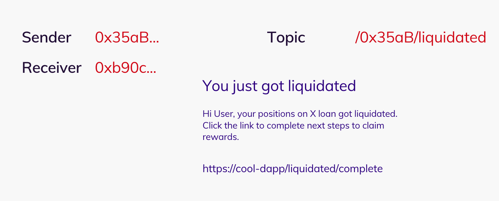

# Reindeer.Ski

Reindeer is a one-stop solution for all your dapp notifications! Not only push notifications, but also email, Discord, and Telegram!!

Indexing `notify` events on Avalanche, Reindeer.ski will notify you when a new notification event is published by your favourite dapps. Publishers can use their private keys to sign the notifications, and Reindeer.ski will verify the signature and send the notification to the intended recipients!

We provide a simple API to register your users and send notifications to them.

## What is a Notification

Each notification consists of a title, a description, dapp display image, and an optional link/CTA button with customisable functionalities.

Each notification has an associated topic with it too. Topics are used to group notifications together.

For example, MQTT protocol notifies the subscribers of a specific topic.

Topic anatomy: `dappAddress/topic/subtopic/subsubtopic`

<!-- Notification Screenshot -->

## How to use Reindeer.Ski

### Subscriptions

Users subscribe to the available dapps by providing a signature. Subscription means that the user allows the DApp to send notifications to their account.

Users can find DApps on the Explore Page and subscribe to them. Publishers can invoke the `subscribeToDApp` cloud function from their websites with the signatures of the users on following data: `sender=${publisherAddress}&topic=${topic}&receiver=${receiverAddress}&platform=1111`. The `platform` is a bitmask of the platforms that the user wants to receive notifications from.

Users can connect Discord/Telegram/Email accounts on the Settings Page. Whenever a new notification is published, Reindeer.ski will send the notification to the connected accounts.

### Registrations

#### `Publisher`

For publishers to register their addresses, head to the Address registration page and fill the form.
The subscribers to this address can then receive the notifications signed by this publisher. The messages sent by publishers are signed by their private keys. This mode is useful for DApps that have an existing infrastructure for indexing events and calculations and would just want to plug the notification system in it.

#### `DApps`

For the new DApps, devs can `sponsor` their DApp on the Reindeer.ski contract. Sponsorship grants the DApps quotas for sending notifications. What this means is that the sponsored contract addresses can emit events like `Notify(....)` and Reindeer will index them and send notifications to the subscribers.

On the other hand, if the DApps don't want to emit the event, their Devs can submit a PR to this repository with the custom event ABIs and onSave triggers. These submitted snippets will be included into the Reindeer.ski Moralis Server. Developers will still need to `sponsor` the contract address to push the notifications to the users.
We wanted this feature to be decentralised but it can be abused by malicious `onSave` triggers.
